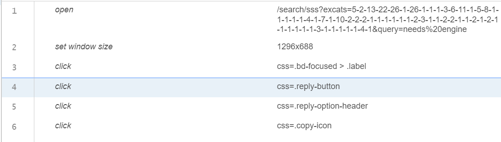

im working in an Organization called Gear Trybe Inc. Im a python developer intern.Im writing some findings I found during research. Basically, company wants to extract the contact info of any person selling his car on "sfbay.craigslist.org".This can be done by developing a scraper. I want you to make a report of the research I have done. Please just make report of the following research:
1. Searching for the query:

        ALL:
        - url: https://sfbay.craigslist.org/search/sss?excats=5-2-13-22-26-1-26-1-1-1-3-6-11-1-5-8-1-1-1-1-1-4-1-7-1-10-2-2-2-1-1-1-1-1-1-2-3-1-1-2-2-1-1-2-1-2-1-1-1-1-1-1-3-1-1-1-1-1-4-1&query=needs%20engine#search=1~list~0~0

        By Owner:
        - url: https://sfbay.craigslist.org/search/sss?excats=5-2-13-22-26-1-26-1-1-1-3-6-11-1-5-8-1-1-1-1-1-4-1-7-1-10-2-2-2-1-1-1-1-1-1-2-3-1-1-2-2-1-1-2-1-2-1-1-1-1-1-1-3-1-1-1-1-1-4-1&purveyor=owner&query=needs%20engine

        By Dealer:
        - url: https://sfbay.craigslist.org/search/sss?excats=5-2-13-22-26-1-26-1-1-1-3-6-11-1-5-8-1-1-1-1-1-4-1-7-1-10-2-2-2-1-1-1-1-1-1-2-3-1-1-2-2-1-1-2-1-2-1-1-1-1-1-1-3-1-1-1-1-1-4-1&purveyor=dealer&query=needs%20engine#search=1~list~0~0

        - the url searches for the results having text: "needs engine". 
        - %20 is the URL Encoder syntax

2. Picking the results:

        Full XPath: /html/body/div[1]/main/div[1]/div[5]/ol/li[1]/div/a

        JS Path: document.querySelector("#search-results-page-1 > ol > li:nth-child(1) > div > a")

        Outer HTML: <a tabindex="0" href="https://sfbay.craigslist.org/eby/grd/d/concord-free-heavy-duty-sears-chain/7767433138.html" class="cl-app-anchor text-only posting-title">(FREE) Heavy duty Sears chain drive rototiller - needs engine</a>

        Selector: #search-results-page-1 > ol > li:nth-child(1) > div > a

        we want to go to href link

3. Go to one of the result:
        
        go to url:https://sfbay.craigslist.org/eby/grd/d/concord-free-heavy-duty-sears-chain/7767433138.html
        In this url following info will be given by the ad creator (info will be used in CRM):
            - Make/Model
            - Year
            - Color
            - Drive Train
            - transmission
            - Fuel Type
            - condition

4. Go to reply section for contact info:

        The reply section may contain info for mail/call or both.

        Full XPath: /html/body/section/section/header/div[2]/div/div[1]/div[2]/div/div[2]/div[2]/a

        JS Path: document.querySelector("#\\34 336a589150ebebebb3b4d4fd160dbe55129de87 > div.reply-email-address > a")

        Outer HTML: <a href="mailto:5a1135f0ff323676ac68bd2ed838ebbc@sale.craigslist.org?subject=2014%20Nissan%20Versa%20SL%20-%20Needs%20work&amp;body=%0A%0Ahttps%3A%2F%2Fsfbay.craigslist.org%2Fsby%2Fcto%2Fd%2Fsanta-clara-2014-nissan-versa-sl-needs%2F7767422456.html%0A">5a1135f0ff323676ac68bd2ed838ebbc@sale.craigslist.org</a>

        Selector: #\34 336a589150ebebebb3b4d4fd160dbe55129de87 > div.reply-email-address > a

        we want href mailto.

        